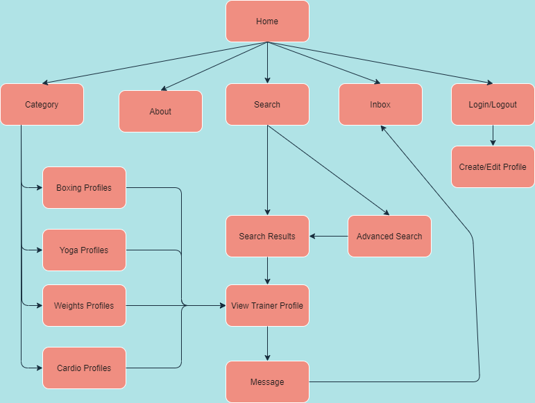
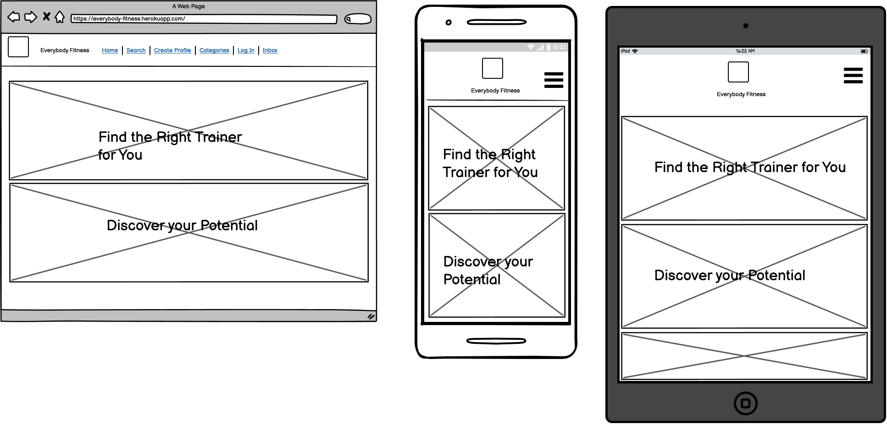
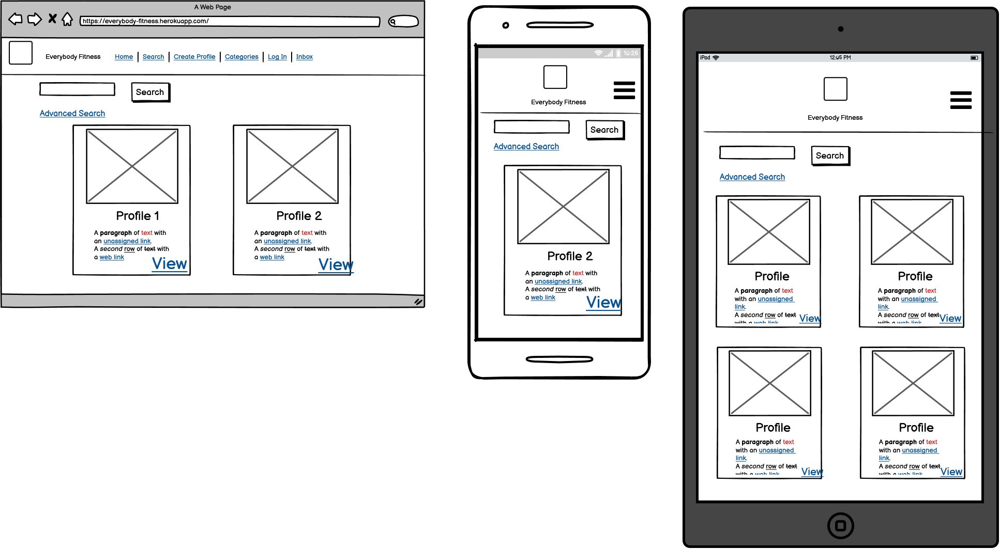
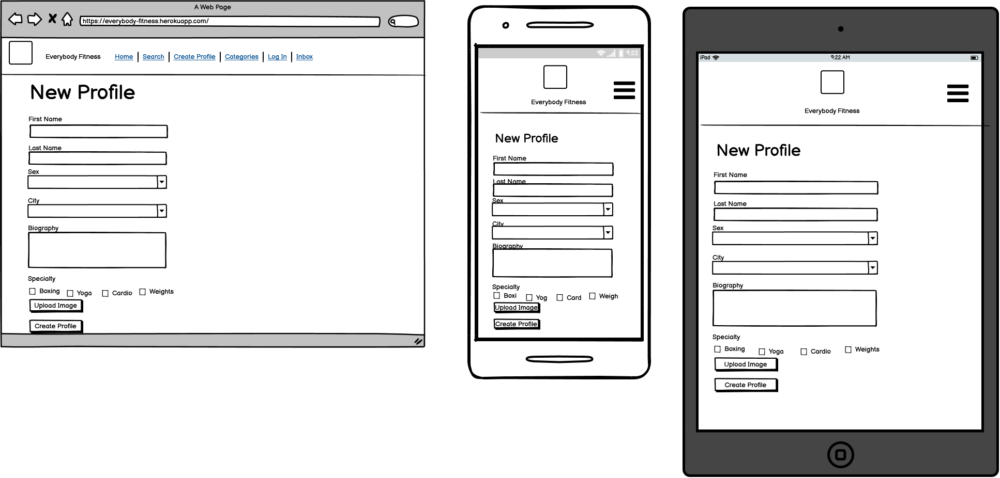
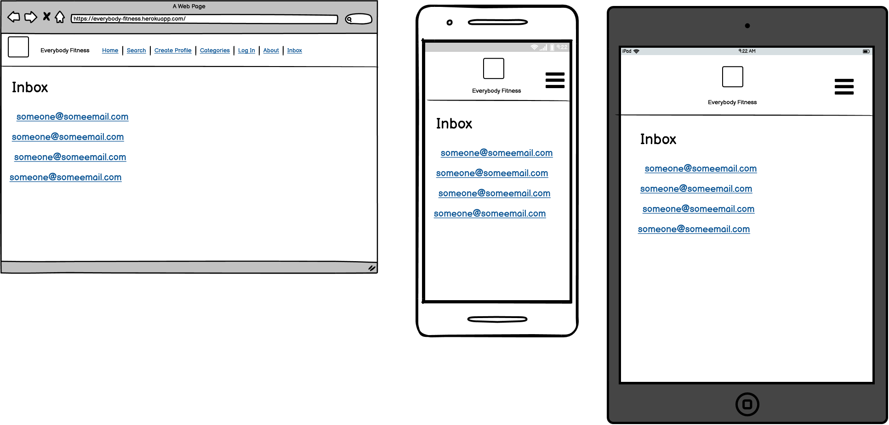
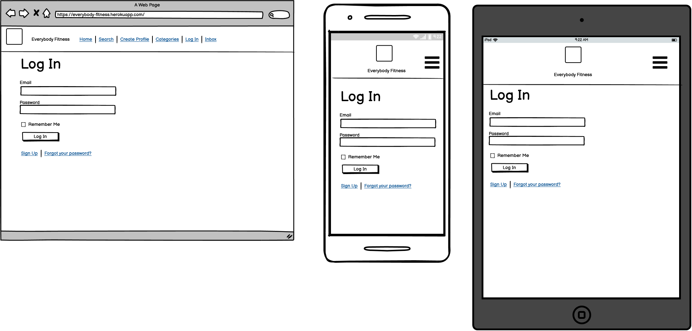
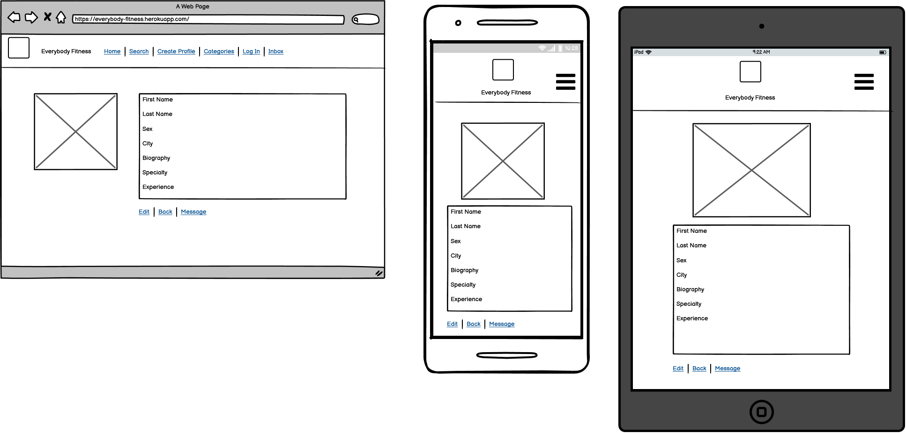
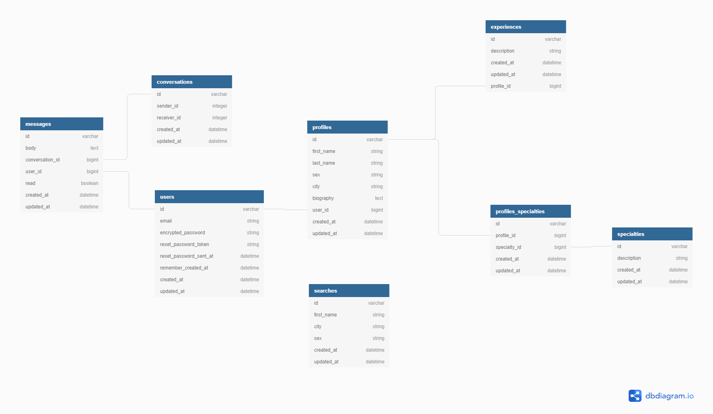
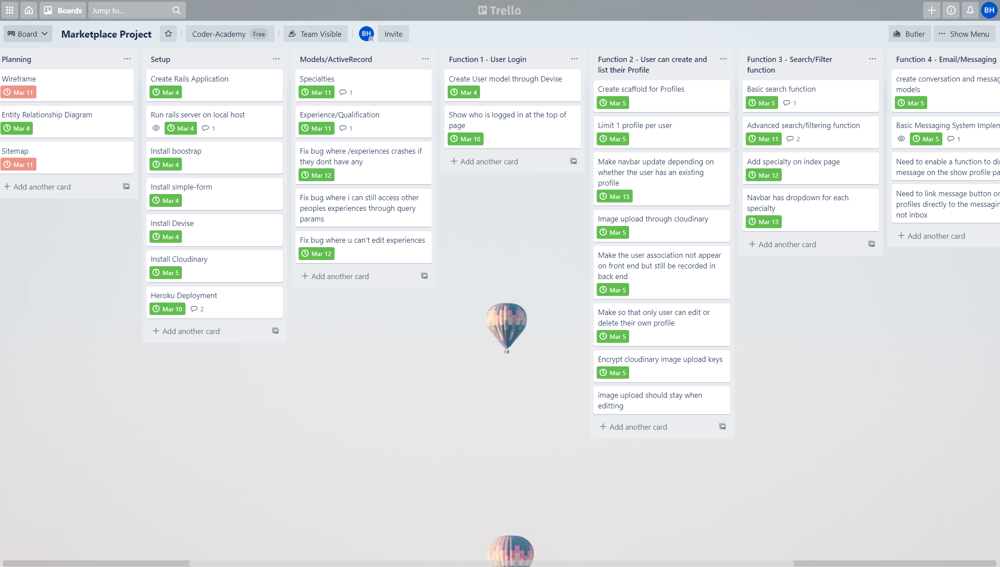

# README

## Installation / Running

--- 

Make a fork of this repo on [https://github.com/brianqhe/everybody-fitness](https://github.com/brianqhe/everybody-fitness)

Clone your fork to your local development environment

Run `git clone git@github.com:brianqhe/everybody-fitness.git`

Change into the directory where you cloned the repo

Install dependencies and gems `bundle install`

Check node dependencies `yarn install --check-files`

Create the database `rails db:create`

Migrate the local database `rails db:migrate`

Run the relevant seeds of the database `rails db:seed`

Run `rails s`

## Problem being solved and why it needs solving
---

With the temporary closure of many gyms around Australia due to the COVID-19 pandemic, many personal trainers were unable to attract new clients, as their gyms could no longer do their advertising for them, and they were no longer able to meet prospective clients at the gym. 

According to the COVID-19 Fitness Industry Impact Report by Fitness Australia, published on April 2020, the following issues were noted - 

- 80% of gyms and sole traders reported decreased revenue and demand
- 100% of gyms made changes to their workforce including reducing work hours and letting staff go

These pose as significant problems to trainers in the fitness industry being able to help clients reach their fitness goals and make a living. 

As a result, the problem attempted to be solved by the proposed application is to allow trainers to still have a platform to be found and advertise their skills, qualifications and specialisations in a much easier way. 

## Link to Application
---

[https://everybody-fitness.herokuapp.com/](https://everybody-fitness.herokuapp.com/)

## Link to Repository
---

[https://github.com/brianqhe/everybody-fitness](https://github.com/brianqhe/everybody-fitness)

## Description of Application
---

### Purpose

The purpose of the application is to serve as a two-way platform for trainers to be found by prospective clients, with their profile being able to be viewed, and directly messaged.

### Functionality / features

- User authentication is ensure such that users are required to log in and enter their password

- User authorisation has been designed into the application such that users can only access certain pages and other pages are restricted access. For example users can only edit or destroy their own profiles, cannot enter the inbox of another user and cannot view another users inbox. 

- There is image uploading capability for a user when creating their own profile. Images are stored on the cloud-based server Cloudinary

- Users can create their own profiles that will include a personalised image, biography and relevant experience/qualifications. These can be editted by the user once logged in at any time.

- Users are able to search for a trainers name in the basic search function. An advanced search function has also been implemented into the app, that allows the user to filter and search for specific profiles catered to their preferences.

- The application features the use of a summarised search of trainers within a certain specialty, e.g. boxing coaches through the use of the dropdown in the navigation bar. 

- Users are able to message one another through the use of a messaging system that will display in their inbox. 

- The application has a responsive navigation bar that will change depending on whether the user is logged in or logged out.

### Sitemap

### Screenshots

### Target audience

The target audience of the web application are personal trainers who seek to grow their client base

The other side of the target audience in this two way marketplace application are the prospective users who want to find a trainer to achieve their fitness goals under the guidance of an experienced trainer.

### Tech stack (e.g. html, css, deployment platform, etc)

- Ruby on Rails was the application framework utilised to provide the default structures for the database, web service and web pages

- PostgreSQL was the database management system used for storing, editting and creating relations for the application

- HTML5 was used as the markup language for the website

- CSS3 was used as the stylesheet for the styles in the website

- SASS was used as the preprocessor to compile the CSS stylesheet

- Heroku was used as the deployment platform, a free third party deployment web application.

- Balsamiq was used at the Wireframe creation tool for the design and repsonsive design tool

- Boostrap was used for a lot of the styling for the application

- Cloudinary was used as the cloud based image and video management service

## User Stories
--- 

As a trainer, I want to be able to create a customisable and updatable profile so I can differentiate myself from other trainers.

As a trainer, I want to be able to advertise my profile, so I can increase my customer base.

As a user, I want to be able to browse for personal trainers on the Internet, so I can achieve my fitness goals.

As a user, I want to be able to filter for a trainers location and gender, so I can train in my most comfortable and suitable environment.

As an endurance athlete, I want to search for a specialist trainer so I can perform better at my next competition. 

As a user, I want to easily message and contact a potential trainer so I can start training sooner to achieve my fitness goals.

## Wireframes
---

**Home Page**

**Search Page** 

**Create Profile** 

**Inbox** 

**Log In**

**View Profile** 

## Entity Relationship Diagram
---

## High Level Components / Abstractions
---

On a high level the web application is built on the Ruby on Rails framework that operates on a Model View Controller architecture which provides the basic and necessary features of a web application. 

The Model is the component that contains the structure and relationships between the databases within the application. The View operates as the component that the end user will be seeing, often styled with CSS and HTML. The Controller contains the logic and functionality of the application, directing how the Model and View should operate when the user gives the website certain commands.

When a user first goes on the application, the Routes component will direct the application to relevant Controller. The Controller will then process the relevant functions in the Model, and display the View page to the end user. 

The application is deployed and hosted on the cloud based service, Heroku, which keeps the application on the Internet.

## Third Party Services
---

The third party services used in the application include the following - 

Devise acts as as the authentication service for the application. Devise as a service provides functions such as allowing users to signup, login, confirm and change their passwords. 

Cloudinary is a cloud based image and video management service that allows images to be uploaded by a user. The reason to use Cloudinary and not a local session storage or ActiveRecord is due to the storage capabilities available through a cloud-based management. Using Cloudinary will prevent storage from being over capacity on local storage. 

Heroku is a cloud based deployment platform that allows the application to be deployed onto a URL on the Internet with relative ease. The platform is compatible with Github such that you can have continuous deployment and also have your source code be updated with your latest code. Heroku also allows the databases used in the application to be scalable with significant amounts of storage capabilities available through the platform.

Bootstrap is a CSS and Javascript based framework that enables responsive web design for the application. The framework contains a large library of templates for navigation, forms and other user interface components. By importing and installing the Bootstrap gem, styling for the application has been made much more optimised for mobile-first development with a lot of styling classes already populated for easy use.

## Models / ActiveRecord Associations
---

The application makes use of 8 models in total. 

These models are - 

- Users
- Profiles
- Specialties
- ProfilesSpecialties
- Experiences
- Messages
- Conversations
- Searches

**Users and Profiles ActiveRecord Association**

Within the application, it is designed such that a user can only set up one profile on the application, so that a user doesn't create an excessive amount of profiles for themselves. In ActiveRecord Association terms, the Profiles model belongs to the User model, and the User model has one Profile. 

**Profiles, Specialties and ProfilesSpecialties ActiveRecord Association** 

The application is designed so that if a user wants to focus only on trainers with a certain specialty such as "Boxing" or "Yoga", they can filter for just those trainers with that specialty. Therefore a trainer Profile should have an ActiveRecord association of a has many Specialties, through a join table named ProfilesSpecialty. When a user creates their profile, they can select the checkboxes of specialties that are applicable to them. This in turn will update a join table on whether the specialty_id of that particular specialty has a record with the profile_id. If a profile_id is associated with a specialty_id in the join table, then that Profile will have that Specialty. The ProfilesSpecialty join table has the foreign keys referencing the profile_id and specialty_id for the Profile and Specialty models respectively. This is an example of the has_many :through ActiveRecord Association. 

**Profiles and Experiences ActiveRecord Association**

The application allows users to add Experiences or qualifications to their Profile for others to see. These experiences should be able to be created, editted and destroyed by the associated Profile user. The ActiveRecord Association is therefore a Profile has_many Experiences. The Experience model will have a foreign key reference to the Profile model through profile_id. This will allow ActiveRecord to select entries from the Experience model where the profile_id matches the current profile owners id. 

**Users, Messages and Conversations ActiveRecord Association** 

Within the application, users should be able to message prospective trainers to get further information or organise a potential session in the future. The models of the application therefore were structure with a Message model and a Conversations model. The models interact in the ActiveRecord Association through a combination of has_many and belongs_to associations. Conversations will have a foreign key association with Users, where there will be a recipient_id and sender_id which uses the user_id of the User. The Conversations model will also have_many messages depending on the conversation. The Messages model will belong to the User and Conversations model, as it will include the message description and conversation_id to determine which conversation the message belongs to. 

**Searches Model**

The Searches model is its own model that operates on a standalone basis. The Searches model is designed to store all the search parameters that have been inputted by the user on the web application. The Searches model will take into account the table columns within the Profiles model. 

## Database Relations
---

With reference to the ERD, the User model was the critical database that would allow the various models to interact with one another. The Profile model had a foreign key to the User model with user_id so that there would be a reference created to ensure that each user had at most one profile. The User model was also referenced by the Conversation and Messages model to ensure that a conversation can be identified by which users in the database are interacting with each other. 

The Profiles model is referenced with foreign keys from other models, being Experiences and ProfilesSpecialty models. By having these models referenced to the Profiles model, it is possible to also extract the user_id when accessing the SQL queries. 

## Task Allocation
---

Tasks were tracked and allocated on the Trello Project Management platform. 

The various stages of the application development were split by columns, with the Planning stage being first. The Planning stage included developing the Entity Relationship Diagram, the wireframes for the application as well as the sitemap. 

Upon completion of the planning stage, the initial set up and its associated tasks were created. These included setting up a new project on the Ruby on Rails framework, installing the planned gems and ensuring the default puma was running correctly. 

Once complete, the relevant features and functions initially planned were each given a new category of tasks, and their respective tasks were given different cards for their priority, as well as a proposed due date. Comments were put on tasks in the case certain bugs were not fully resolved, or to keep a copy of the crucial links/information used in completing the task.

A screenshot and link to the Trello project management board is as follows - 

[https://trello.com/b/hObJsQdl](https://trello.com/b/hObJsQdl)

