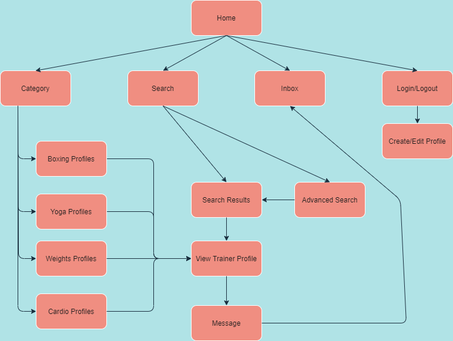

# README

## Installation / Running

--- 

Download Rails

## Problem being solved and why it needs solving
---

With the temporary closure of many gyms around Australia due to the COVID-19 pandemic, many personal trainers were unable to attract new clients, as their gyms could no longer do their advertising for them, and they were no longer able to meet prospective clients at the gym. 

According to the COVID-19 Fitness Industry Impact Report by Fitness Australia, published on April 2020, the following issues were noted - 

- 80% of gyms and sole traders reported decreased revenue and demand
- 100% of gyms made changes to their workforce including reducing work hours and letting staff go

These pose as significant problems to trainers in the fitness industry being able to help clients reach their fitness goals and make a living. 

As a result, the problem attempted to be solved by the proposed application is to allow trainers to still have a platform to be found and advertise their skills, qualifications and specialisations in a much easier way. 

## Link to Application
---

[https://everybody-fitness.herokuapp.com/](https://everybody-fitness.herokuapp.com/)

## Link to Repository
---

[https://github.com/brianqhe/everybody-fitness](https://github.com/brianqhe/everybody-fitness)

## Description of Application
---

### Purpose

The purpose of the application is to serve as a two-way platform for trainers to be found by prospective clients, with their profile being able to be viewed, and directly messaged.

### Functionality / features

- User authentication is ensure such that users are required to log in and enter their password

- User authorisation has been designed into the application such that users can only access certain pages and other pages are restricted access. For example users can only edit or destroy their own profiles, cannot enter the inbox of another user and cannot view another users inbox. 

- There is image uploading capability for a user when creating their own profile. Images are stored on the cloud-based server Cloudinary

- Users can create their own profiles that will include a personalised image, biography and relevant experience/qualifications. These can be editted by the user once logged in at any time.

- Users are able to search for a trainers name in the basic search function. An advanced search function has also been implemented into the app, that allows the user to filter and search for specific profiles catered to their preferences.

- The application features the use of a summarised search of trainers within a certain specialty, e.g. boxing coaches through the use of the dropdown in the navigation bar. 

- Users are able to message one another through the use of a messaging system that will display in their inbox. 

- The application has a responsive navigation bar that will change depending on whether the user is logged in or logged out.

### Sitemap

### Screenshots

### Target audience

The target audience of the web application are personal trainers who seek to grow their client base

The other side of the target audience in this two way marketplace application are the prospective users who want to find a trainer to achieve their fitness goals under the guidance of an experienced trainer.

### Tech stack (e.g. html, css, deployment platform, etc)

- Ruby on Rails was the application framework utilised to provide the default structures for the database, web service and web pages

- PostgreSQL was the database management system used for storing, editting and creating relations for the application

- HTML5 was used as the markup language for the website

- CSS3 was used as the stylesheet for the styles in the website

- SASS was used as the preprocessor to compile the CSS stylesheet

- Heroku was used as the deployment platform, a free third party deployment web application.

- Balsamiq was used at the Wireframe creation tool for the design and repsonsive design tool

## User Stories
--- 

As a trainer, I want to be able to create a customisable and updatable profile so I can differentiate myself from other trainers.

As a trainer, I want to be able to advertise my profile, so I can increase my customer base.

As a user, I want to be able to browse for personal trainers on the Internet, so I can achieve my fitness goals.

As a user, I want to be able to filter for a trainers location and gender, so I can train in my most comfortable and suitable environment.

As an endurance athlete, I want to search for a specialist trainer so I can perform better at my next competition. 

As a user, I want to easily message and contact a potential trainer so I can start training sooner to achieve my fitness goals.

## Wireframes
---

## Entity Relationship Diagram
---

## High Level Abstractions
---

## Third Party Services
---

The third party services used in the application include the following - 

Devise

Cloudinary

Heroku

## Models / ActiveRecord Associations
---

The application makes use of 8 models in total. 

These models are - 

- Users
- Profiles
- Specialties
- ProfilesSpecialties
- Experiences
- Messages
- Conversations
- Searches

**Users and Profiles ActiveRecord Association**

Within the application, it is designed such that a user can only set up one profile on the application, so that a user doesn't create an excessive amount of profiles for themselves. In ActiveRecord Association terms, the Profiles model belongs to the User model, and the User model has one Profile. 

**Profiles, Specialties and ProfilesSpecialties ActiveRecord Association** 

**Profiles and Experiences ActiveRecord Association**

**Users, Messages and Conversations ActiveRecord Association** 

**Searches Model**

## Database Relations
---

## Database Schema Design
---

## Task Allocation
---

Tasks were tracked and allocated on the Trello Project Management platform. 

The various stages of the application development were split by columns, with the Planning stage being first. The Planning stage included developing the Entity Relationship Diagram, the wireframes for the application as well as the sitemap. 

Upon completion of the planning stage, the initial set up and its associated tasks were created. These included setting up a new project on the Ruby on Rails framework, installing the planned gems and ensuring the default puma was running correctly. 

Once complete, the relevant features and functions initially planned were each given a new category of tasks, and their respective tasks were given different cards for their priority, as well as a proposed due date. Comments were put on tasks in the case certain bugs were not fully resolved, or to keep a copy of the crucial links/information used in completing the task.

A screenshot and link to the Trello project management board is as follows - 

[https://trello.com/b/hObJsQdl](https://trello.com/b/hObJsQdl)

